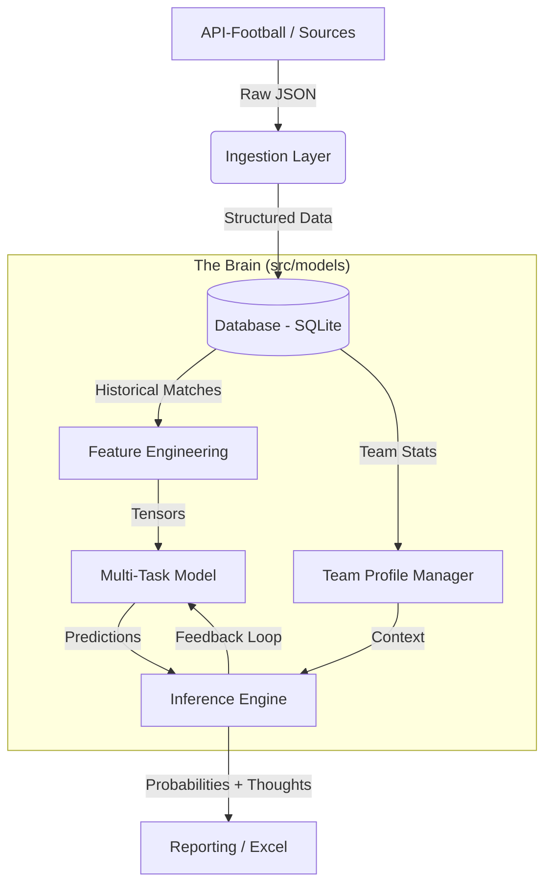

# System Architecture

## High-Level Overview

The **Football Brain Core** operates as a continuous learning pipeline. It ingests raw match data, processes it into structured features, trains a Multi-Task Neural Network, and generates predictions with explanations.



## Core Layers

### 1. Ingestion Layer (`src/ingestion`)
Responsible for communicating with external APIs (API-Football) and parsing raw responses.
- Handles rate limiting and caching.
- Normalizes team names and league IDs.

### 2. Database (`src/db`)
A relational store (SQLite) acting as the single source of truth.
- **Tables**: `leagues`, `teams`, `matches`, `odds` (from oddsportal), `predictions`.
- Uses SQLAlchemy/ORM for abstraction.

### 3. Feature Engineering (`src/features`)
Tranforms raw match statistics into model-ready vectors.
- **Rolling Averages**: Last 5/10 games stats.
- **H2H**: Head-to-head history.
- **Elo/Rating**: Team strength quantification.
- **OHE**: One-Hot Encoding for categorical variables (League, Day of Week).

### 4. Modeling (`src/models`)
The intellectual core.
- **MultiTaskModel**: A PyTorch-based neural network that predicts multiple outputs (Home Win, Draw, Away Win, BTTS, Over/Under) simultaneously from a shared representation.
- **TeamProfile**: A non-parametric memory bank that stores specific "personality" traits of teams (e.g., "Always scores at home", "Weak against counter-attacks").

### 5. Evolution (`src/evolution`)
Implements the self-improving loop.
- **Lazarus Logic**: Resurrection of "dead" (underperforming) models/strategies if they show potential in new contexts.
- **Fisher Information**: Used to measure how much a model "knows" about a specific task/team.

## Class Diagram

```mermaid
classDiagram
    class MultiTaskModel {
        +input_size: int
        +shared_layers: Sequential
        +market_heads: ModuleDict
        +forward(x)
        +predict(x)
    }

    class TeamProfile {
        +team_id: int
        +profile: Dict
        +build_comprehensive_profile()
        +analyze_form_cycles()
    }

    class TeamProfileManager {
        +profiles: Dict
        +get_or_create_profile()
        +build_all_profiles()
    }

    TeamProfileManager *-- "many" TeamProfile : manages
    MultiTaskModel ..> "Features" : uses
```
